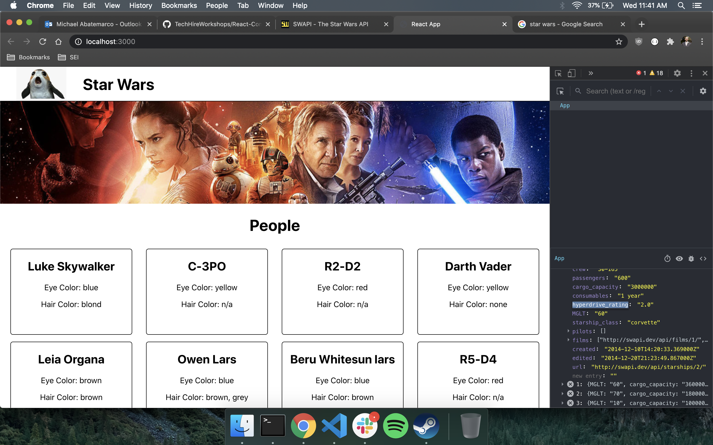
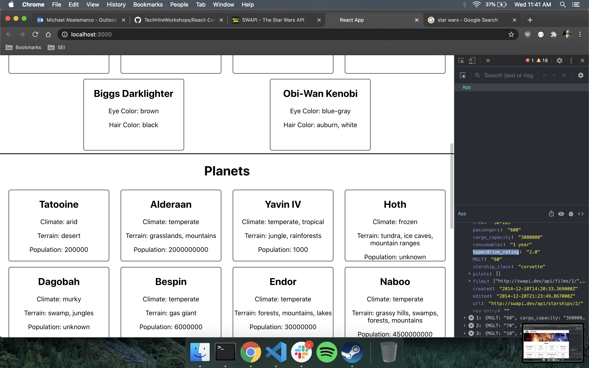
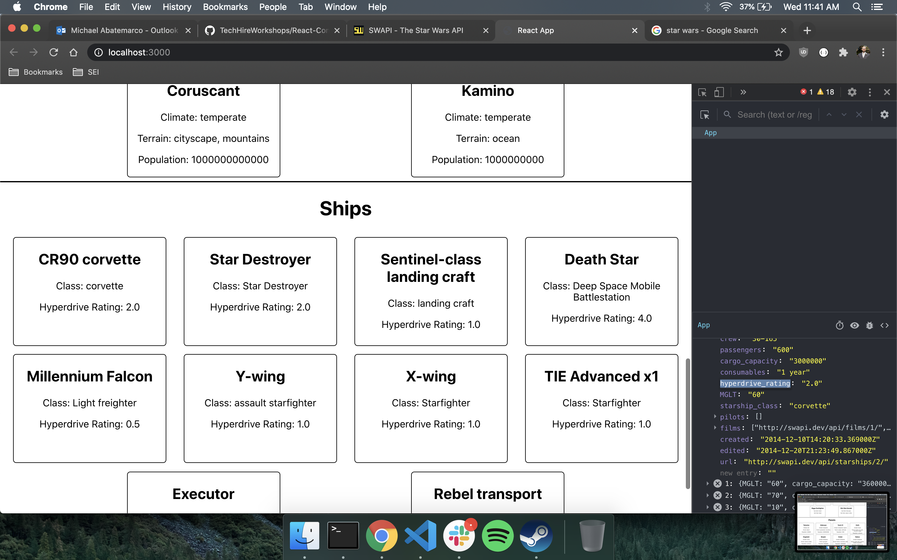
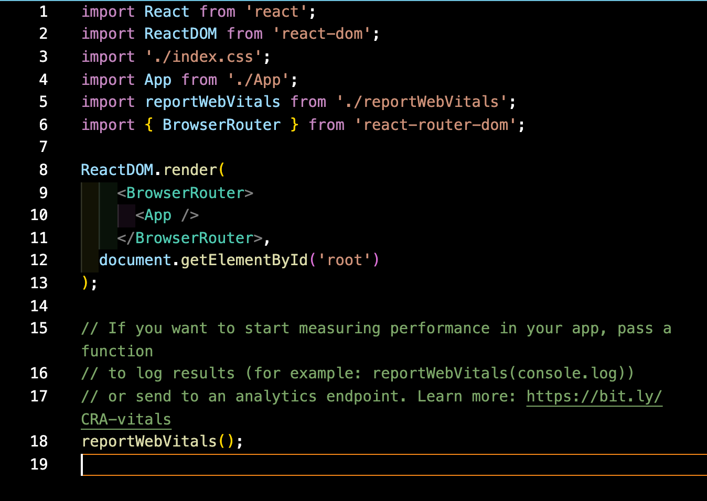

# React Continues

Last time, we saw how to create a basic React app.  

We learned about components, the core concepts of React, where we piece up the parts of our page into their own files, with HTML and JS together.

We learned about state, React's system for storing data in variables, where changes to data in state are reflected by changes on the view of the site.

We learned about conditional rendering, how we can use the truth value of data to show or hide certain elements on our page.

We learned how to pass data from state down using props, where we include the data we want accessible in the tags of the component when we call them.

We also learned a bit about the component lifecycle, and how we can run functions when a component loads or updates with useEffect.

Let's practice!

## Our App

Today we'll be building an app similar to the one we made in the last lessons.  Let's see what it looks like and figure out what components we need, and how to organize them.

Let's build it!

## React Router Dom

React is what's known as a single-page application (SPA), which means exactly what it sounds like: there is only one page to the whole thing.  The only file that ever loads in our browser is index.html (which is populated with data from our App.jsx file.)

This does not mean that we can only have one view on our sites though.  We've seen that we can control what shows on the screen through conditional rendering, and that is not just limited to small elements, we can conditionally render entire "pages."

There is a better option though: [React Router Dom!](https://reactrouter.com/web/guides/quick-start)

React Router Dom allows us to manipulate the url our browser is pointed at, and also allows our app to respond to these changes, showing parts of the site when a certain url shows up on the screen.

### Using Router

Let's start by installing and setting up our Router

In the project repo, run

	npm install react-router-dom
	
Then, in Index.js, import and wrap <App/> in the BrowserRouter wrapper

You might see that in the place where we'll be putting `<BrowserRouter>`, there is already something about using strict mode.  This isn't necessary, so feel free to delete it.

Now that we've got router installed, let's learn about its two main uses: Link and Route.

Remember to import Link and/or Route on any component where it's being used

	import {Link, Route} from 'react-router-dom'

### Link

The `<Link></Link>` tag works similarly to the anchor tags we've seen before, with a few differences. Link is used to reset the url of the browser, *without refreshing the page.* Link also only works within our own React app, not for external links. We use Link with its `to=` property, like so:

	<Link to='/characters'>View Characters</Link>
	
We don't need to write out the full url we want to redirect the user to, just what we want to show up after the base url. So if the React website we are using is www.starwarsinfo.com, using that Link will send us to www.starwarsinfo.com/characters.

### Route

Now that we can control the url of the page we're on, we also need to be able to respond to it.  Route is how we can do that.  We can think of Route very similar to how we use conditional rendering.  When Route detects a certain url, it renders the components or elements inside of it.  An example:

	<Route path='/characters'
		<CharactersPage/>
	</Route>
	
Here, we see that our CharactersPage component is nested in a Route.  The Route is listening for when our url ends in '/characters,' and when it does, it renders the CharactersPage component.

Let's set up some different pages!

#### Path vs Exact path

When setting the url path to watch for in a <Route> tag, we can use `path=` or `exact path=`.  Using path by itself looks to see if that path exists at all, while exact path looks to see if the url path matches exactly.

Say we set up two separate Routes:

	<Route path='/characters'>
	
and

	<Route exact path = '/characters'>
	
If we have a url ending in '/characters', both of those Routes will trigger.  if we have a url ending in '/characters/createnewcharacter', the first Route (path) will trigger, while the second (exact path) will not.

When we use path, it sees that '/characters' is part of '/characters/createnewcharacter', and that is good enough.  When we use exact path, it sees that '/characters' is not exactly the same as '/characters/createnewcharacter', and does not render what is inside the tag.

### Routing Parameters

Now we can use different pages, but what if we want a single page that we can use for different things? What if we wanted a Character Details page that we could use for any character the user clicked on? How would it know what character we wanted on the page? We could always store the selected character in state and pass it down to the detail page component, but if we have many such pages, our state would soon become unmanageable.

Router has a solution for that as well. We can store and retrieve information in our url called *parameters.* We can define parameters like so:

	<Route path='/characters/:characterId'
		<CharacterDetails/>
	</Route>
	
The ':' symbol, called a slug, is used in routes to define parameters. It means that we are not expected the url to have the actual string 'characterId', but tells router that any string or number that comes after '/characters' is a parameter value.

We have defined the route '/characters/[any string or number]', which leads to the CharacterDetails page.  Within the CharacterDetails page, there now exists a variable characterId within the parameters of the page.

We still need to retrieve the parameter, and we can do so using the `useParams` method. We import useParams

	import {useParams} from 'react-router-dom'
	
and then use this syntax to save the characterId param as a variable within our page with the same name.
	
	const {characterId} = useParams()
	
We now have another way to direct a user to a page capable of showing specific data!
